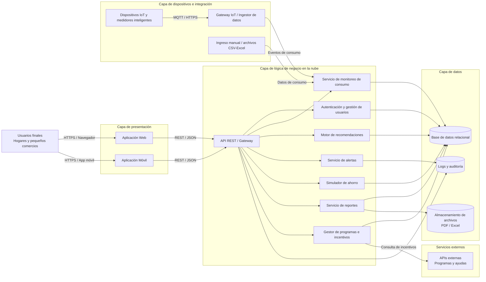

# ArquitecturaTecnologica-Enersmart.md

```mermaid
flowchart LR

    %% CAPA DE USUARIOS
    U[Usuarios finales<br/>Hogares y pequeños comercios]

    %% CAPA DE PRESENTACIÓN
    subgraph FRONTEND [Capa de presentación]
        FW[Aplicación Web]
        FM[Aplicación Móvil]
    end

    %% CAPA DE LÓGICA DE NEGOCIO
    subgraph BACKEND [Capa de lógica de negocio en la nube]
        API[API REST / Gateway]
        AUTH[Autenticación y gestión de usuarios]
        MON[Servicio de monitoreo de consumo]
        REC[Motor de recomendaciones]
        ALERT[Servicio de alertas]
        SIM[Simulador de ahorro]
        REP[Servicio de reportes]
        PROG[Gestor de programas e incentivos]
    end

    %% CAPA DE DATOS
    subgraph DATA [Capa de datos]
        DB[(Base de datos relacional)]
        FILES[(Almacenamiento de archivos<br/>PDF / Excel)]
        LOGS[(Logs y auditoría)]
    end

    %% CAPA IOT E INGESTA DE DATOS
    subgraph IOT [Capa de dispositivos e integración]
        DEV[Dispositivos IoT y medidores inteligentes]
        IOTGW[Gateway IoT / Ingestor de datos]
        MAN[Ingreso manual / archivos CSV-Excel]
    end

    %% SERVICIOS EXTERNOS
    subgraph EXT [Servicios externos]
        EXTAPI[APIs externas<br/>Programas y ayudas]
    end

    %% FLUJO DE USUARIOS
    U -->|HTTPS / Navegador| FW
    U -->|HTTPS / App móvil| FM

    FW -->|REST / JSON| API
    FM -->|REST / JSON| API

    %% ORQUESTACIÓN BACKEND
    API --> AUTH
    API --> MON
    API --> REC
    API --> ALERT
    API --> SIM
    API --> REP
    API --> PROG

    %% BACKEND HACIA DATOS
    AUTH --> DB
    MON --> DB
    REC --> DB
    SIM --> DB
    REP --> DB
    PROG --> DB

    REP --> FILES
    ALERT --> LOGS
    API --> LOGS

    %% CAPA IOT
    DEV -->|MQTT / HTTPS| IOTGW
    IOTGW -->|Eventos de consumo| MON

    MAN -->|Datos de consumo| MON

    %% SERVICIOS EXTERNOS
    PROG -->|Consulta de incentivos| EXTAPI
```
